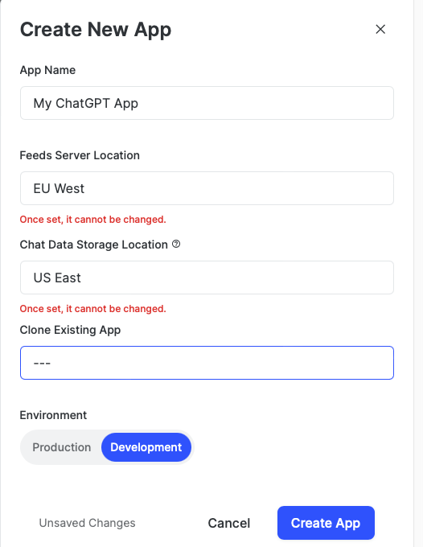
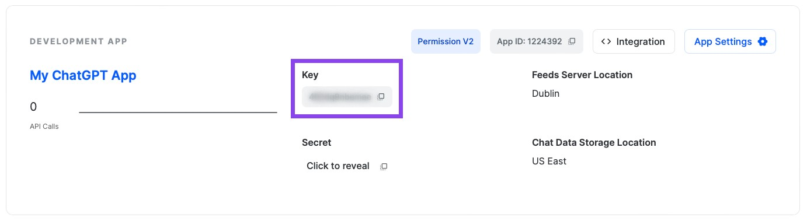
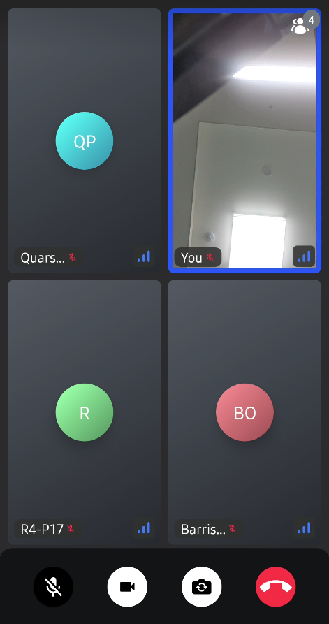

<p align="center">
  <a href="https://opensource.org/licenses/Apache-2.0"></a>
  <a href="https://android-arsenal.com/api?level=21"></a>
  <a href="https://github.com/GetStream/meeting-room-compose/actions/workflows/android.yml"></a>
  <a href="https://getstream.io?utm_source=Github&utm_medium=Github_Repo_Content_Ad&utm_content=Developer&utm_campaign=Github_Aug2023_Jaewoong_MeetingRoomCompose&utm_term=DevRelOss"></a>
</p>

This is a real-time meeting room app built with Jetpack Compose and [Stream Video SDK for Compose](https://getstream.io/video/docs/android?utm_source=Github&utm_medium=Github_Repo_Content_Ad&utm_content=Developer&utm_campaign=Github_Aug2023_Jaewoong_MeetingRoomCompose&utm_term=DevRelOss), with a design reminiscent of Google Meet.

The primary objective of this repository is to showcase the following:

- Complete implementation of UI components using Jetpack Compose.
- Development of a real-time meeting room application with a seamless user experience, designed in a Google Meet style by customizing [CallContent](https://getstream.io/video/docs/android/ui-components/call/call-content?utm_source=Github&utm_medium=Github_Repo_Content_Ad&utm_content=Developer&utm_campaign=Github_Aug2023_Jaewoong_MeetingRoomCompose&utm_term=DevRelOss) and [ParticipantVideo](https://getstream.io/video/docs/android/ui-components/participants/participant-video?utm_source=Github&utm_medium=Github_Repo_Content_Ad&utm_content=Developer&utm_campaign=Github_Aug2023_Jaewoong_MeetingRoomCompose&utm_term=DevRelOss).
- Creation of a lobby screen that provides control over physical devices before joining a meeting room, including toggling the camera/microphone and flipping the camera view.
- Illustration of multiple participants connecting from various platforms, such as web and Android.

## ✍️ Technical Content

If you're keen on learning about constructing a real-time meeting room application using Jetpack Compose, we recommend exploring **[Build a Real-Time Meeting Room App for Android With Jetpack Compose](https://getstream.io/blog/comoise-meeting-room/)**.

## :bulb: Additional Repositories

If you're interested in exploring more repositories that utilize Jetpack Compose and Stream SDK, take a look at the following repositories:

- [ChatGPT Android](https://github.com/skydoves/chatgpt-android): 📱 ChatGPT Android demonstrates OpenAI's ChatGPT on Android with Stream Chat SDK for Compose.
- [Whats App Clone Compose](https://github.com/getStream/whatsApp-clone-compose): 📱 WhatsApp clone project demonstrates modern Android development built with Jetpack Compose and Stream Chat SDK for Compose.
- [Slack Clone Android](https://github.com/GetStream/stream-slack-clone-android): 📱 A chat demo app built with Jetpack Compose and Stream Chat SDK following clean architecture principles.
- [Stream Draw Android](https://github.com/getStream/stream-draw-android): 🛥 Stream Draw is a real-time multiplayer drawing & chat game app built entirely with Jetpack Compose.
- [Facebook Messenger Clone](https://github.com/MathRoda/Messenger-clone): Facebook Messenger clone using Stream SDK & Jetpack Compose.

## 📲 Download APK
Go to the [Releases](https://github.com/GetStream/meeting-room-compose/releases) to download the latest APK.

<a href="https://getstream.io/video/docs/android?utm_source=Github&utm_medium=Github_Repo_Content_Ad&utm_content=Developer&utm_campaign=Github_Aug2023_Jaewoong_MeetingRoomCompose&utm_term=DevRelOss">

</a>

## 🛥 Stream Video SDK

**Meeting Room Compose** is built with __[Stream Video SDK for Compose](https://getstream.io/video/docs/android?utm_source=Github&utm_medium=Github_Repo_Content_Ad&utm_content=Developer&utm_campaign=Github_Aug2023_Jaewoong_MeetingRoomCompose&utm_term=DevRelOss)__ to implement real-time video room features.
If you’re interested in adding powerful In-App Video Calling, Audio Room, Livestream features to your app, check out the __[Android Video Calling Tutorial](https://getstream.io/video/docs/android/tutorials/video-calling/utm_source=Github&utm_medium=Github_Repo_Content_Ad&utm_content=Developer&utm_campaign=Github_Aug2023_Jaewoong_MeetingRoomCompose&utm_term=DevRelOss)__!

- [Stream Video SDK for Android on GitHub](https://github.com/getStream/stream-video-android)
- [Video Call Tutorials](https://getstream.io/video/docs/android/tutorials/video-calling?utm_source=Github&utm_medium=Github_Repo_Content_Ad&utm_content=Developer&utm_campaign=Github_Aug2023_Jaewoong_MeetingRoomCompose&utm_term=DevRelOss)
- [Audio Room Tutorials](https://getstream.io/video/docs/android/tutorials/audio-room?utm_source=Github&utm_medium=Github_Repo_Content_Ad&utm_content=Developer&utm_campaign=Github_Aug2023_Jaewoong_MeetingRoomCompose&utm_term=DevRelOss)
- [Livestream Tutorials](https://getstream.io/video/docs/android/tutorials/livestream/?utm_source=Github&utm_medium=Github_Repo_Content_Ad&utm_content=Developer&utm_campaign=Github_Aug2023_Jaewoong_MeetingRoomCompose&utm_term=DevRelOss)

## 💻 Build Your Own Video Meeting Room Project

<details>
 <summary> If you want to build your own video meeting room project, you should follow the instructions below:</summary>

<de>

1. Go to the __[Stream login page](https://getstream.io/try-for-free?utm_source=Github&utm_medium=Github_Repo_Content_Ad&utm_content=Developer&utm_campaign=Github_Aug2023_Jaewoong_MeetingRoomCompose&utm_term=DevRelOss)__.
2. If you have your GitHub account, click the **SIGN UP WITH GITHUB** button and you can sign up within a couple of seconds. 


3. If you don't have a GitHub account, fill in the inputs and click the **START FREE TRIAL** button.
4. Go to the __[Dashboard](https://dashboard.getstream.io?utm_source=Github&utm_medium=Github_Repo_Content_Ad&utm_content=Developer&utm_campaign=Github_Aug2023_Jaewoong_MeetingRoomCompose&utm_term=DevRelOss)__ and click the **Create App** button like the below.


5. Fill in the blanks like the below and click the **Create App** button.



6. You will see the **Key** like the figure below and then copy it.



7. Go to the [MeetingRoomApp](https://github.com/GetStream/meeting-room-compose/blob/main/app/src/main/kotlin/io/getstream/meeting/room/compose/MeetingRoomApp.kt#L39) class and change the `apiKey` property with your key.

8. Build and run the project.

</details>

## 📷 Previews

<p align="center">


</p>

## 🛠 Tech Stack & Open Source Libraries

- Minimum SDK level 21.
- 100% [Jetpack Compose](https://developer.android.com/jetpack/compose) based + [Coroutines](https://github.com/Kotlin/kotlinx.coroutines) + [Flow](https://kotlin.github.io/kotlinx.coroutines/kotlinx-coroutines-core/kotlinx.coroutines.flow/) for asynchronous.
- [Stream Video SDK for Compose](https://getstream.io/video/docs/android?utm_source=Github&utm_medium=Github_Repo_Content_Ad&utm_content=Developer&utm_campaign=Github_Aug2023_Jaewoong_MeetingRoomCompose&utm_term=DevRelOss): Stream's versatile Core + Compose UI component libraries that allow you to build video calling, audio room, and, live streaming apps based on Webrtc running on Stream's global edge network.
- Jetpack
  - Compose: Android’s modern toolkit for building native UI.
  - ViewModel: UI related data holder and lifecycle aware.
  - Navigation: For navigating screens and [Hilt Navigation Compose](https://developer.android.com/jetpack/compose/libraries#hilt) for injecting dependencies.
  - [Hilt](https://dagger.dev/hilt/): Dependency Injection.
- [Retrofit2 & OkHttp3](https://github.com/square/retrofit): Construct the REST APIs and paging network data.
- [Sandwich](https://github.com/skydoves/sandwich): An adaptable and lightweight sealed API library designed for Kotlin and Android, specializing in efficient Retrofit response modeling and exception handling.
- [ksp](https://github.com/google/ksp): Kotlin Symbol Processing API.

## 👨‍👨‍👦‍👦 Testing Multiple Participants

For interactive tests across different platforms, you can utilize Stream web applications. You can simply join the web application with [Stream Video Web Demo](https://getstream.io/video/demos/?id=GzGQPrISLSHk).


## 🤝 Contribution

Most of the features are not completed except the chat feature, so anyone can contribute and improve this project following the [Contributing Guideline](https://github.com/GetStream/meeting-room-compose/blob/main/CONTRIBUTING.md).

## Find this repository useful? 💙
Support it by joining __[stargazers](https://github.com/GetStream/meeting-room-compose/stargazers)__ for this repository. :star: <br>
Also, follow __[maintainers](https://github.com/skydoves)__ on GitHub for our next creations! 🤩

# License
```xml
Copyright 2023 Stream.IO, Inc. All Rights Reserved.

Licensed under the Apache License, Version 2.0 (the "License");
you may not use this file except in compliance with the License.
You may obtain a copy of the License at

   http://www.apache.org/licenses/LICENSE-2.0

Unless required by applicable law or agreed to in writing, software
distributed under the License is distributed on an "AS IS" BASIS,
WITHOUT WARRANTIES OR CONDITIONS OF ANY KIND, either express or implied.
See the License for the specific language governing permissions and
limitations under the License.
```
